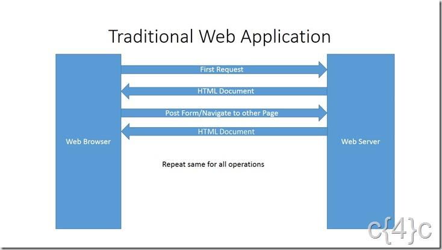
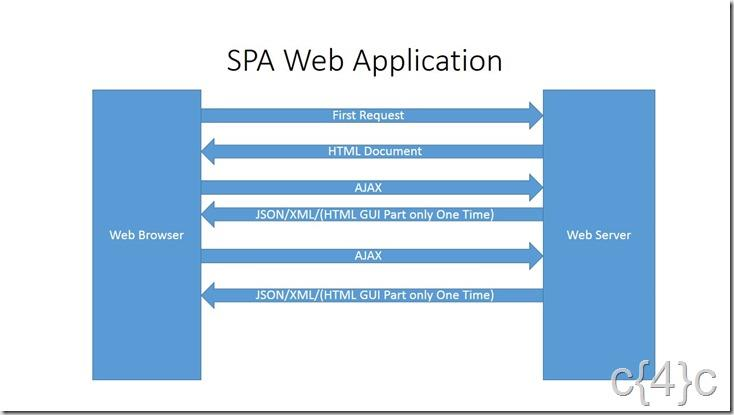

% 
% Conception et réalisation d’une application web de qualité, un cheminement d’ingénieur logiciel
% Emmanuel Payet

# Entreprise

--- 

### De nombreux changements

* Présente de plus en plus a l'international
* Mise sur les nouvelles technologies et la qualité logicielle
* Changement de méthodologie et d'architecture

---

### Ma place dans l'entreprise

* Mon Equipe et son role

# Projet d'étude

## Contexte et Motivations

* Couts élevés
* Recherche de meilleures méthode et architecture
* Utilisation de l'expertise de notre équipe

## Description

## Objectif principal

* Créer un logiciel de qualité ? C'est quoi ?
    * Développement rapide de fonctionnalités (temps = argent)
    * Développement de nouvelles fonctionnalités sans impact sur l’existant (non régression)
    * Posséder une architecture évolutive permettant de limiter la dette technique et l’apparition des bugs
    * Déploiements fréquents et rapides en production, permettant de satisfaire la demande du client
    * S’assurer que l’application fonctionne toujours en production

## Autres objectifs

* Utilisation de notre expertise web pour créer une application mobile
* Démonstration de l’intérêt de l’utilisation des nouvelles technologies
* Isolation de la logique du domaine métier
* Concrétisation des nouveaux changements chez Cdiscount
* Intérêt d’avoir des petites équipes polyvalentes (pizza teams) 

# Choix d'architecture

## Monolithe

« *De l’application simple à l’application à tout faire, il n’y a qu’un pas.* », Julien Dubreuil.

## Inconvénients

* Développement ralenti 
* Petit changement = Grand impact 
* Gestion de l’échec 
* Engagement à long terme sur une technologie

## Microservices

* KISS : Keep It Simple Stupid

---

# Architecture globale de l'application

---

---

## Deux types de logiques

* DDD
* Logique métier
* Logique applicative

## Architecture > Technologies

# Choix technologiques

# Méthodologie

# Résultat du projet

## Résultats

## Challenges

## Objectifs atteints ?

# Conclusion

---

* architecte = conception
* développeur = réalisation
* ingénieur logiciel = conception ET réalisation

[moduleCounts]: images/npm_modules.PNG
