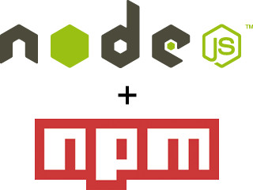

% 
% Conception et réalisation d’une application web de qualité, un cheminement d’ingénieur logiciel
% Emmanuel Payet

# Présentation

---

* Bordelaise
* Créé en 1998
* Groupe Cnova / Casino
* C.A. : 1,6 Milliard d’euros
* 1200 salariés
* Présente de plus en plus à l'international

---

### Ma place dans l'entreprise

* 3 ans d'alternance
* Equipe Services
* Equipe Lab (R&D)

---

### Mes missions

* WSManager
* Portail développeur openAPI <small>(<a target="blank" href="https://dev.cdiscount.com">https://dev.cdiscount.com</a>)</small>
* POC web mobile
* Organisation de coding dojos
* Formation d'un développeur junior

# Projet d'étude : POC

---

### Applications mobiles actuelles

* Nombreuses
* Multiples plateformes (Android, iOS)
* Natives + sites mobiles
* Sous-traitance

---

### Contexte et Motivations

* Coûts élevés
* Recherche de meilleures méthodes et architectures
* Ré-intégrer le développement en interne

---

### Ce que nous proposons

* Reproduction de l'application Android actuelle
* Technologies web uniquement
* Application web + mobile (hybride) avec le même code
* Cross-plateforme
* Architecture et méthodologie travaillée
* Qualité logicielle
* 2 mois de développement

---

### Objectif principal : Qualité logicielle

* Développement rapide de fonctionnalités <small>(temps = argent)</small>
* Sans régression, ni dette technique
* Architecture évolutive
* Déploiements fréquents et rapides en production
* Satisfaire la demande du client
* Limiter les bugs
* Production toujours en marche

# Choix d'architecture

---

### Monolithe

« *De l’application simple à l’application à tout faire, il n’y a qu’un pas.* », Julien Dubreuil.

---

### Inconvénients

* Développement ralenti 
* Petit changement = Grand impact 
* Gestion de l’échec 
* Engagement à long terme sur une technologie

---

### Microservices

* Chaque application est un ensemble de services
* Communication avec des mécanismes légers (HTTP)
* Service = 1 Fonctionnalité
* Déploiements indépendants
* Ecrits dans différents langages
* Différentes technologies de stockage de données

---

### Philosophie et implémentation

* <u>KISS</u> : Keep It Simple Stupid
* <u>SOA</u> : Intègre différentes applications comme un ensemble de services
* <u>Microservices</u> : Architecture chaque application comme un ensemble de services

---

---

---

### Avantages

* Petit et focus sur une seule fonctionnalité 
* Bonne décomposition des modules
* Déploiements indépendants 
* Diversité technologique
* Scalabilité fonctionnelle
* Réécriture limitée à un seul service

---

## Architecture   >   Technologies

 <!--had to insert something, or else bug ???-->

# Choix technologiques

---

---

---

---

### Front-end

---

### Back-end

---

### Containers

---

### Deux types de logiques

* Logique métier
* Logique applicative

# Choix de méthodologie

---

### Cycle en V

---

### Méthodes agiles

* SCRUM
* Extreme Programming

--- 

### Ce que nous retenons

* Testing
* Déploiement continu
* Code review
* Pas de dette technique
* Utiliser les bons outils
* Bonne communication
* Bien-être des membres de l'équipe

# Résultat du projet

---

### Démonstration du développement d’une fonctionnalité

* Création d'une nouvelle branche sur git
* Écriture de tests de haut niveau (Intégration / UI)
* Écriture du code source en TDD strict
* Code review par un autre membre de l’équipe
* Intégration de la nouvelle branche
* Vérification de la non régression

---

### Fonctionnalités développées

* Accueil 
* Navigation 
* Fiche produit 

---

### Challenges

* Intégration des SPA chez Cdiscount
* Performances de l'application hybride
* Challenge technique (Microservices)

## Objectifs atteints ?

# Conclusion

---

* Architecte = Conception
* Développeur = Réalisation
* Ingénieur Logiciel = Conception ET Réalisation

---

### Logiciel de qualité

# Des questions ?
